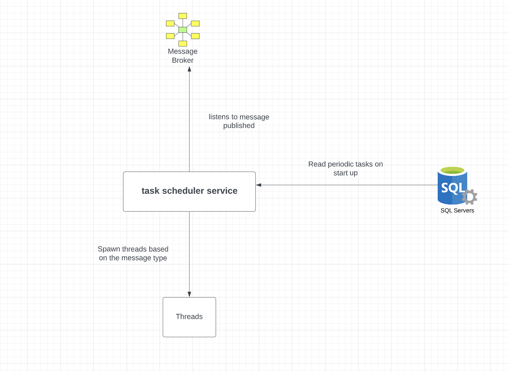

# Overview

Task scheduler does the following.

1. [TaskexecutorApplication](./src/main/java/com/soru/taskexecutor/TaskexecutorApplication.java) has RabbitMQ listener which listens to the data published to queue ```taskqueue```.
   Based on the [MessageType](./src/main/java/com/soru/taskexecutor/model/MessageType.java) it receives , it decides whether it is a [FunctionTask](./src/main/java/com/soru/taskexecutor/task/FunctionTask.java) or
   [WebhhookTask](./src/main/java/com/soru/taskexecutor/task/WebhhookTask.java)

2. On start up it fetches all the periodic scheduled tasks from [ScheduleTask](./src/main/java/com/soru/taskexecutor/entity/ScheduleTask.java) and schedule a thread using executors.
3. TODO On restart of system , Before we schedule the periodic tasks , we need to see if they have already run for the current period , if yes we need to add delay accordingly at [SchedulePeriodicTaskServiceImpl](./src/main/java/com/soru/taskexecutor/service/impl/SchedulePeriodicTaskServiceImpl.java)

## How to use

1. Set up RabbitMQ using docker or in the local using brew/apt.
2. Create a queue named taskqueue.
3. Add the RabbitMQ properties in [application.yml](./src/main/resources/application.yml).
4. Publish the message like below

`{
"messageType" : "WEBHOOK",
"data" : "123"
}`

5. Run the application , it will listen to the non received messages as well.

## Options considered

1. Thought of using `@Scheduled(cron = "0 * 9 * * ?")` annotation , but then we need another periodic task we need to change the code.
2. Considered Redisson , but I think it is based on TTL and hence we may have to feed the task again.

## Diagram


